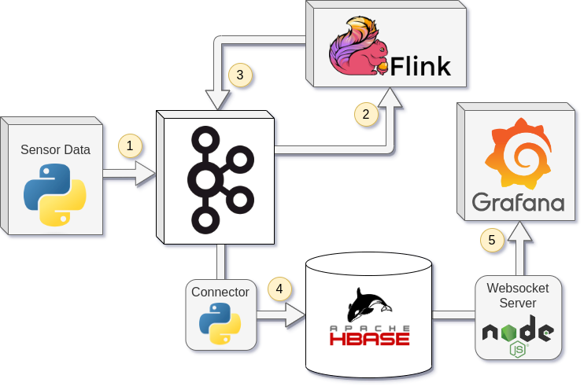

# IoT Live Streaming System for Information Systems Course

This is a project for the Information Systems course at the NTUA. The goal of this project is to create a live streaming system for IoT devices.

## System Architecture



The system system's data flow is as follows:

1. Data is generated from a python script immitating a series of IoT devices and gets sent to a Kafka broker.

2. The data is then consumed by an Apache Flink instance which performs a series of aggregation and filtering operations on the data.

3. The data is then sent back to the Kafka broker in appropriate topics. A copy of the original sensor data is also sent to a Kafka topic for later storage.

4. The data present in topics populated by Flink is then consumed by a python script which sends the data to an Apache Hbase instance using the Apache Triton API.

5. A Grafana instance is used to visualize the data stored in the Hbase instance. The data gets transfered using a Node.js Websocket server that periodically queries the Hbase instance.

## Installation

### Step 1: Clone the repository

```bash
$ git clone URL
```

### Step 2: Install Docker and Docker-Compose

Refer

### Step 3: Docker compose

Inside the root directory of the project run the following command to start the system:

```
docker-compose up
```

### Step 4: Live Streaming Layer

Requires java 11, jdk.

```
java -jar liveStreamingLayer/flinkExecutable.jar
```

### Step 5: Device Layer

This is the producer of the data of the IoT devices.
Requires python 3, confluent_kafka, numpy, pillow, matplotlib, scipy.

```
python3 deviceLayer/run_producer.py
```

### Step 6: Data Storage Layer - Syncing

This takes the data from the kafka topic and puts it in the hbase database.

```
./dataStorageLayer/sync.sh
```

### Step 7: Websocket Server

This is the server that connects the grafana dashboard to the hbase database. Go to `/dataStorageLayer/websockets_server` and run the following command:

```
npm install
```

and then

```
npm run start
```

### Step 8: Grafana set up

Go to `http://localhost:3000` and log in with the following credentials:

```
admin - admin
```

Then add the datasource with this script:

```
./presentationLayer/import_data_sources.sh
```

and at last import the dashboard from the `presentationLayer` folder, using the grafana GUI, dashboard->import.
