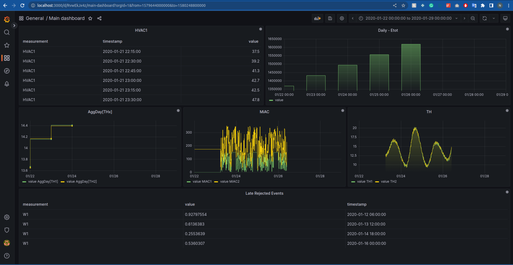

# Grafana - Presentation Layer

In this directory we used the grafana image in the docker-compose file. We used the grafana image to create a dashboard that shows the data from the live streaming layer.

## Websockets

We use a websocket server from npm to connect the grafana dashboard to the live streaming layer. The websocket server is in the presentationLayer/websocketServer directory. The server is written in javascript and uses the npm websocket package.

## Grafana plugins

We used the following plugins:

- [WebSocket API](https://grafana.com/grafana/plugins/golioth-websocket-datasource/)

## Example of dashboard

